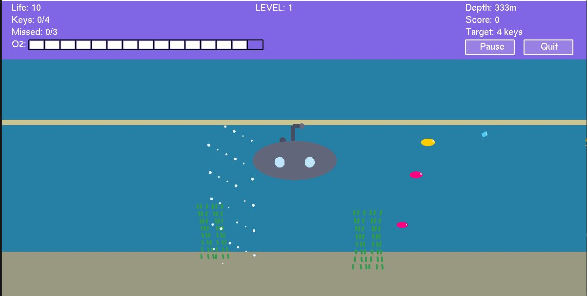
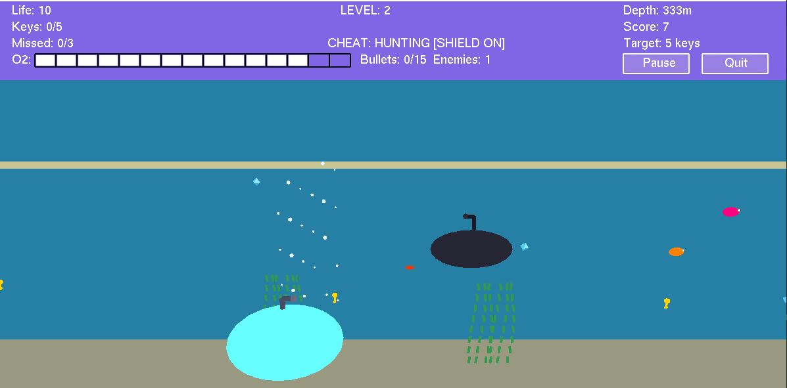

# Submarine Adventure: An Interactive OpenGL Graphics Game

> A complete interactive 3D/2D computer graphics game rendered from scratch in Python utilizing the PyOpenGL and GLUT rendering frameworks. Features dynamic viewport mechanics, bounding-box collision grids, and real-time environment state pipelines.

[](https://www.python.org/)
[](https://www.opengl.org/)
[]()

---

### 🖼️ Gameplay Preview
| Main Menu & Level 1 | Underwater Combat & Level 2 |
| :---: | :---: |
|  |  |

---

## 📌 1. About the Project

**Submarine Adventure** is an arcade-style maritime navigation game built as a core capstone for a Computer Graphics engineering curriculum. 

Instead of sitting on top of modern high-overhead game engines like Unity or Unreal, this software acts as its own engine framework. It handles raw primitive rendering, real-time keyboard matrix translations, direct camera viewport transformations, custom lighting/shading vectors, and explicit structural state machines completely from scratch inside `submarine_adventure.py`.

### 🎮 Game Features & Mechanics
* **Pilotable Submarine Mechanics:** Full keyboard directional flight matrix mapping allowing smooth traversal throughout an interactive underwater scene boundary.
* **Multi-Level Progression Engine:** Adaptive algorithmic complexity layers. Advancing to Level 2+ dynamically scales obstacle speeds, adjusts target objectives, and spawns hostiles.
* **Dynamic Resource & Risk Gauges:** Real-time oxygen exhaustion bars that require surfacing pipelines to recharge, paired with a multi-hit health point threshold vector.
* **Enemy Submarine AI & Projectiles:** Multi-threaded threat generation where hostile units track boundaries and fire coordinated bullet entities targeted at player coordinates.
* **Integrated Interactive Sandbox System:** Clickable HUD button triggers paired with toggleable "Cheat Modes" to automate diamond tracking metrics or deploy vector defense shields.

---

## 💡 2. Computer Graphics & Engineering Implementation

This repository showcases several fundamental pillars of computer graphics architecture and algorithmic mathematics:

### 📐 Structural Rendering & Matrix Transformations
* **Multi-Perspective Camera Configurations:** Integrates active view manipulations (`glMatrixMode(GL_PROJECTION)`) mapped across zoom-scaling operations (`gluPerspective`) and explicit matrix tracking cameras (`gluLookAt`) managed via user inputs.
* **Split-Screen Viewport Pipeline:** Implements structural viewport splits (`glViewport`) to isolate real-time informational heads-up displays (HUDs) from the core underlying gameplay coordinate bounds.
* **Algorithmic Asset Math:** Renders complex entities (submarines, animated seaweeds, fish, bubbles) out of raw coordinate vectors, trigonometric circle routines ($r\cos\theta, r\sin\theta$), and complex line loops.

### 🛡️ Runtime Math & Simulation Physics
* **AABB Bounding-Box Collision Grid:** Continuous algorithmic tracking of Euclidean distance boundaries between the player asset coordinate space and obstacles to evaluate object intersections instantly.
* **Dynamic Object Management Spawners:** Algorithmic initialization and recycling of entity arrays to handle real-time rendering, translation offsets, and out-of-bounds cleanup without inducing overhead lag or memory leaks.

---

## 🚀 3. Getting Started & Setup Layout

### Prerequisites
To run this rendering engine locally, you need Python 3.x installed along with its native package-managed bindings for the OpenGL framework:
```bash
pip install PyOpenGL PyOpenGL_accelerate

```

*(Note: No manual library folders are required locally; standard native bindings are resolved automatically across cross-platform runtime layers via pip).*

### Local Execution Strategy

1. **Clone the Repository:**
```bash
git clone https://github.com/SakibMahmud111/opengl-submarine-adventure.git
cd opengl-submarine-adventure

```


2. **Execute the Game Loop Engine:**
```bash
python submarine_adventure.py

```


### ⌨️ Interactive Controls Guide

* **Submarine Movement:** Use the Arrow Keys (`Up`, `Down`, `Left`, `Right`) to navigate underwater boundaries.
* **Camera System Configurations:** * `A` / `S` : Zoom In / Zoom Out
* `D` / `F` : Pan Camera Left / Pan Camera Right
* `G` / `H` : Move Camera Up / Move Camera Down


* **Utility Triggers:** `C` / `c` to toggle Cheat Mode; `R` / `r` to instantly reset execution vectors after a Game Over window.

---

## 📁 4. Repository Structure

```filepath
├── screenshots/               # Visual presentation directory for documentation assets
│   ├── 1.JPG
│   ├── 2.JPG
│   ├── 3.JPG
│   ├── 4.JPG
│   └── 5.JPG
├── submarine_adventure.py     # Principal entry point / Core game loop source code
├── Submarine_Adventure_Game.pdf  # Technical specification and design breakdown report
├── .gitignore                 # Workspace environment and Python cache isolation rules
└── README.md                  # Interactive portfolio project presentation

```
